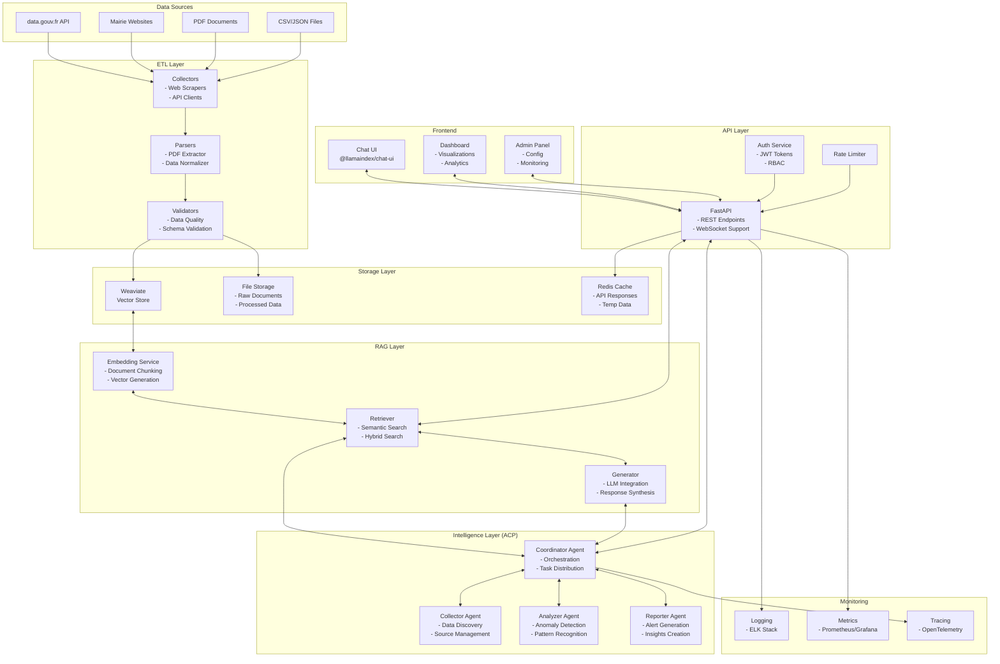

# Mairie Radar - System Architecture

## Overview

Mairie Radar uses a layered architecture designed for scalability, maintainability, and extensibility. The system is built around four core layers with additional supporting components.

## Architecture Diagram



## Development Phases

### POC/MVP Focus (Phases 1-2)
For rapid prototyping and beta testing, we focus on core functionality:
- **Core Layers**: ETL, Storage (Weaviate only), RAG, Intelligence (ACP)
- **Simplified Stack**: Python + LangChain + FastAPI + Chat UI
- **Package Manager**: uv (project name: "maire")
- **Excluded**: Redis caching, PostgreSQL, monitoring, async processing

### Production Focus (Phases 3-4)
Advanced features for scalability and enterprise readiness:
- **Full monitoring stack**: Prometheus, Grafana, logging
- **Caching layer**: Redis for performance
- **Database**: PostgreSQL for metadata and audit
- **Async processing**: Celery/RabbitMQ for background tasks

## Core Architecture Layers

### 1. ETL Layer (Extract, Transform, Load)
**Purpose**: Collect, process, and standardize budget data from various sources

**Components**:
- **Collectors**: Web scrapers, API clients for data.gouv.fr
- **Parsers**: PDF extractors, CSV/JSON parsers
- **Transformers**: Data normalizers, schema validators
- **Loaders**: Batch upload to Weaviate, file storage management

**Technology Stack**:
- LangChain document loaders
- BeautifulSoup/Selenium for web scraping
- PyPDF2/pdfplumber for PDF processing
- Pandas for data transformation

### 2. Storage Layer
**Purpose**: Persist and index data for efficient retrieval

**Components**:
- **Weaviate Vector Store**: Semantic search and similarity matching
- **File Storage**: S3-compatible storage for raw documents
- **Redis Cache**: API response and temporary data caching
- **PostgreSQL**: Metadata, audit logs, user data

**Schema Design**:
```python
class BudgetDocument:
    city_name: str
    year: int
    category: str
    amount: float
    document_url: str
    extracted_text: str
    embedding: vector
    metadata: dict
```

### 3. RAG Layer (Retrieval-Augmented Generation)
**Purpose**: Enable intelligent search and response generation

**Components**:
- **Embedding Service**: 
  - Document chunking strategies
  - Vector generation with OpenAI/local models
  - Hybrid search (keyword + semantic)
- **Retriever**:
  - Semantic search in Weaviate
  - Re-ranking algorithms
  - Context window optimization
- **Generator**:
  - LLM integration (GPT-4, Claude, local models)
  - Prompt engineering
  - Response synthesis

**Implementation**:
```python
from langchain.chains import RetrievalQA
from langchain.vectorstores import Weaviate

rag_chain = RetrievalQA.from_chain_type(
    llm=llm,
    retriever=weaviate_retriever,
    chain_type="stuff"
)
```

### 4. Intelligence Layer (ACP-based)
**Purpose**: Coordinate autonomous agents for complex analysis tasks

**Agent Communication Protocol (ACP) Architecture**:
- **Coordinator Agent**: Orchestrates multi-agent workflows
- **Collector Agent**: Autonomous data discovery and collection
- **Analyzer Agent**: Pattern recognition and anomaly detection
- **Reporter Agent**: Insight generation and alert creation

**ACP-SDK Integration**:
```python
from acp_sdk import Agent, Message, Protocol

class BudgetAnalyzerAgent(Agent):
    def __init__(self):
        super().__init__(
            name="budget_analyzer",
            capabilities=["anomaly_detection", "trend_analysis"]
        )
    
    async def process_message(self, message: Message):
        # Implement analysis logic
        pass
```

## Supporting Components

### API Layer (FastAPI)
- RESTful endpoints for CRUD operations
- WebSocket support for real-time updates
- GraphQL endpoint for complex queries
- API versioning and documentation

### Frontend Layer
- **Chat UI**: Using @llamaindex/chat-ui
- **Dashboard**: Data visualizations with Chart.js/D3.js
- **Admin Panel**: System configuration and monitoring

### Security Layer
- JWT-based authentication
- Role-based access control (RBAC)
- API rate limiting with Redis
- Data encryption (AES-256)

### Monitoring & Observability
- **Logging**: Structured logging with Python logging + ELK
- **Metrics**: Prometheus + Grafana dashboards
- **Tracing**: OpenTelemetry for distributed tracing
- **Alerting**: AlertManager + PagerDuty integration

## Data Flow

1. **Collection Phase**:
   ```
   Data Sources → Collectors → Parsers → Validators → Storage
   ```

2. **Query Phase**:
   ```
   User Query → API → RAG Layer → Weaviate → Response Generation
   ```

3. **Analysis Phase**:
   ```
   Scheduled Task → Coordinator Agent → Analysis Agents → Insights → Alerts
   ```

## Deployment Architecture

### Development Environment
- Docker Compose setup
- Local Weaviate instance
- Mock data for testing

### Production Environment
- Kubernetes deployment
- Managed Weaviate Cloud
- Auto-scaling with HPA
- Multi-region deployment

### CI/CD Pipeline
- GitHub Actions for testing
- Docker image building
- Automated deployments
- Blue-green deployment strategy

## Scalability Considerations

1. **Horizontal Scaling**:
   - Stateless API servers
   - Distributed agent processing
   - Read replicas for databases

2. **Performance Optimization**:
   - Query result caching
   - Batch processing for ETL
   - Async task processing

3. **Cost Optimization**:
   - LLM token usage monitoring
   - Intelligent caching strategies
   - Scheduled vs real-time processing

## Technology Choices Rationale

| Component | Technology | Rationale |
|-----------|------------|-----------|
| Vector DB | Weaviate | Free tier, good Python support, hybrid search |
| LLM Framework | LangChain | Extensive ecosystem, RAG support |
| Agent Framework | ACP-SDK | Standardized communication, scalability |
| API Framework | FastAPI | Async support, automatic docs |
| UI Library | @llamaindex/chat-ui | MIT license, LLM-focused, customizable |
| Cache | Redis | Fast, versatile, good Python support |
| Monitoring | Prometheus/Grafana | Open source, industry standard |

## Security & Compliance

- RGPD/GDPR compliant data handling
- No personal data storage
- Audit trail for all operations
- Regular security assessments

## Future Enhancements

1. **Multi-language Support**: Extend beyond French
2. **ML Models**: Custom anomaly detection models
3. **Blockchain Integration**: Immutable audit trails
4. **Mobile Apps**: iOS/Android applications
5. **API Marketplace**: Third-party integrations

## Getting Started

See [SETUP.md](SETUP.md) for detailed setup instructions and [CONTRIBUTING.md](CONTRIBUTING.md) for development guidelines. 